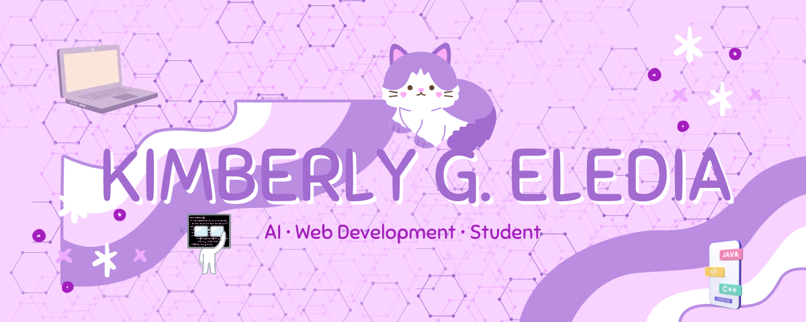

<h1 align="center">Hi 👋, I'm Kim</h1>

  

---

## 🌸 About Me

- 🎓 BS Information Technology Student
- 💻 Passionate about Web Development and Artificial Intelligence
- 🌱 Currently learning Flask, MongoDB, and Machine Learning
- 🚀 Building projects that solve real-world problems
- 🎯 Goal: Become a Software Developer specializing in AI and Web Technologies

---

## 🚀 Currently Working On

- 🍽️ Hapag – AI-Powered Meal Planning System
- 💅 Smart NailScan – AI System for Detecting Health Indicators through Nail Analysis
- 🌿 NutriLeaf
- 🐾 FurCareHub

---

## 💻 Tech Stack

---

## 📊 GitHub Stats

---

## 🔥 GitHub Streak

---

## 🏆 GitHub Trophies

---

## 📫 Connect With Me

📧 Email: kimyeledia@gmail.com

---

⭐ Code with purpose. Build with passion.
